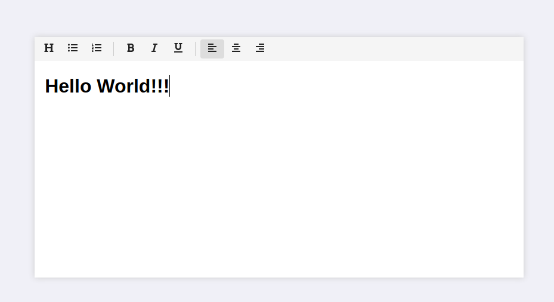

<h1 align="center">
  📝 Rich Text Editor
</h1>

  

  

  

  

  

  <a href="#-tecnologias">Tecnologias</a>&nbsp;&nbsp;&nbsp;|&nbsp;&nbsp;&nbsp;
  <a href="#-demo">Demo</a>&nbsp;&nbsp;&nbsp;|&nbsp;&nbsp;&nbsp;
  <a href="#-licença">Licença</a>

 

  

## 🚀 Tecnologias

Esse projeto foi desenvolvido com as seguintes tecnologias:

- [React JS](https://pt-br.reactjs.org/): Uma biblioteca JavaScript para criar interfaces de usuário.
- [Draft.js](https://draftjs.org/): Framework de Rich Text Editor para React.
- [Sass](https://sass-lang.com/): Pré processador de CSS.

## ⚡ Demo

Esse projeto é um simples editor rich text desenvolvido para me familiarizar com o Framework **Draft.js**.

Você pode acessar o resultado final [aqui](https://reacteditor.netlify.app/).

## 📝 Licença

Esse projeto está sob a licença MIT. Veja o arquivo [LICENSE](LICENSE.md) para mais detalhes.

---

Feito com ♥ by [Danilo Gonçalves](https://github.com/goncadanilo). Me adicione no [LinkedIn](https://www.linkedin.com/in/goncadanilo/) :wave:
